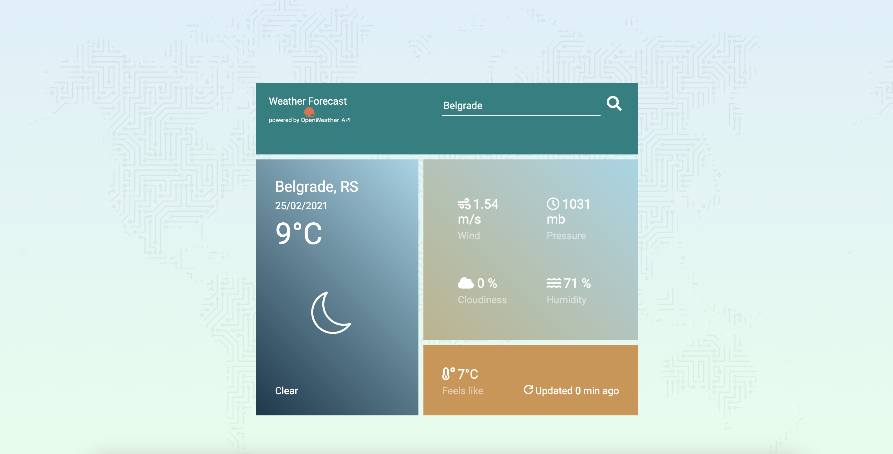

# ☔️ Weather app

App shows weather data based on current location (Geolocation API) or for any city searched by its name.

Uses metric system and allows access to current weather data such as temperature, humidity, pressure and many more.

## How it is built?

- HTML and CSS;
- Vanilla JS;
- [OpenWeather API] (https://openweathermap.org/).
